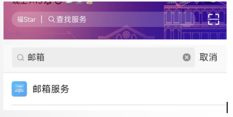
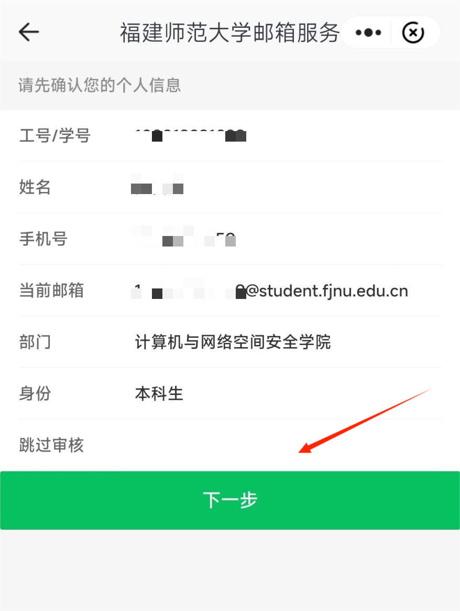
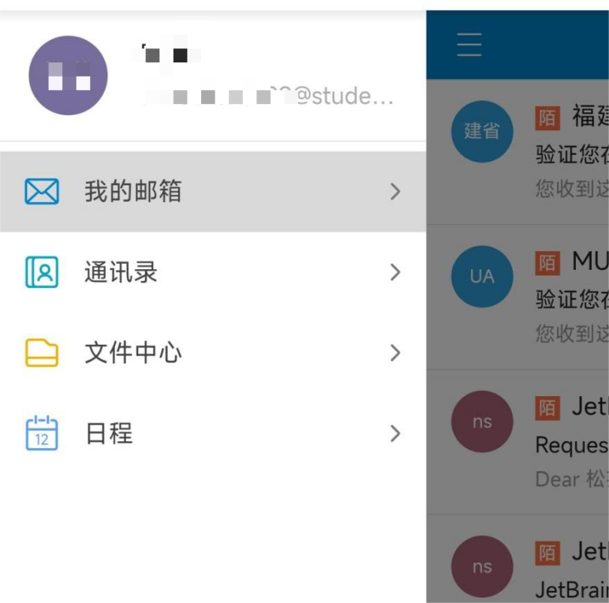

# Fstar校园邮箱注册
> 本服务器采用了第三方皮肤站验证，而注册第三方账号**需要使用校园邮箱接收验证链接**（学信网也可但请参阅MUA官方文档）本节为福师大校园邮箱注册的方法（协和学院通用）

>* 注意事项：
>* 如果你是樱之町一周目的老玩家，那么你已经注册过了校园邮箱，可跳转皮肤站注册（如果忘记邮箱密码或不知道还能不能正常使用也可以去Fstar app查看）
>
>* 如果是已经毕业的校友或者还未到校的新生，**可能无法注册邮箱**，请直接于群内联系管理员人工注册（或尝试使用MUA官方站注册）

### 手机APP端注册方法：
* 注：（目前校园邮箱只支持手机端注册使用）
#### 1.在应用商店下载福star app

#### 2.打开并登录:
* 注：如果你是第一次使用福star，那么你的账号是学号，密码为身份证后6位（如果有X那么X是大写），登录后按指引认证即可

#### 3.进入主页后在上方的查找服务输入邮箱，并点击邮箱服务：

#### 4.点击邮箱注册并点击下一步开通即可

#### 5.随后可在浏览器（手机/pc均可）进入网页登录邮箱：
http://student.fjnu.edu.cn/

